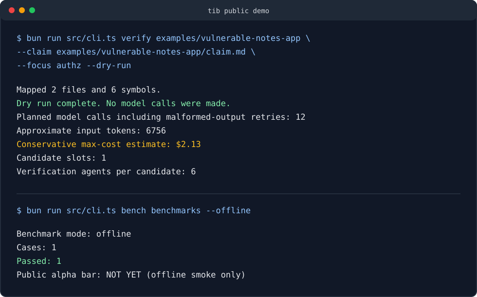

# tom-in-a-box

[](LICENSE)
[](https://bun.sh)
[](https://github.com/Atomics-hub/tom-in-a-box/releases/tag/v0.1.0-alpha)

`tib` is a verification-first source-code security audit CLI. It helps a solo researcher turn a repo and a vulnerability claim into a checked, ranked result by running independent agents whose job is to confirm, disprove, duplicate-check, and format the finding before submission.

The short version:

> A source-code security audit copilot that tries to disprove findings before you submit them.

Scanners create alerts. `tib` cross-examines findings.

## Proof Snapshot

Private-corpus public-alpha bar:

- 2 live model passes
- 10 accepted positives
- 20 known negatives
- 10 / 10 positives observed as `SUBMIT`
- 0 known-negative `SUBMIT` verdicts

The private corpus is not published because it may contain disclosure-sensitive research and source snapshots. The public repo includes the methodology, harness, no-spend demo, and aggregate proof ledger.

## Demo



## Status

This project is pre-alpha. The core CLI, six-agent verification flow, benchmark harness, and local artifact writer exist. The public release bar is intentionally strict: two live benchmark passes over accepted findings and known negatives, with zero known-negative `SUBMIT` verdicts.

Use this as researcher assistance, not as an autonomous submission system or replacement for expert review.

Current proof status is tracked in [docs/PROOF.md](docs/PROOF.md).

Read [LIMITATIONS.md](LIMITATIONS.md) before using live model runs or sharing generated reports.

## Install

Requirements:

- Bun 1.3 or newer
- Git
- An Anthropic API key for live model runs

```sh
bun install
bun run src/cli.ts doctor
```

Build a local binary:

```sh
bun run build
./dist/tib --help
```

## Quickstart

Create config:

```sh
bun run src/cli.ts init-config
```

`~/.tib/config.toml`:

```toml
anthropic_api_key = "sk-ant-..."
default_focus = "authz"
hunter_model = "claude-sonnet-4-6"
verification_model = "claude-opus-4-7"
max_candidates = 10
cost_cap_usd = 20
```

`ANTHROPIC_API_KEY` in the environment overrides the config file.

Run a full audit:

```sh
bun run src/cli.ts audit https://github.com/org/repo --focus authz --max-candidates 3 --cost-cap 10
```

Verify a specific claim:

```sh
bun run src/cli.ts verify ./repo --claim examples/sample-claim.md --focus authz --cost-cap 4
```

Estimate cost without model calls:

```sh
bun run src/cli.ts verify ./repo --claim examples/sample-claim.md --focus authz --dry-run
```

Run the offline smoke benchmark:

```sh
bun run src/cli.ts bench benchmarks --offline
```

Try the public no-spend demo:

```sh
bun run src/cli.ts verify examples/vulnerable-notes-app \
  --claim examples/vulnerable-notes-app/claim.md \
  --focus authz \
  --dry-run
```

Sample artifacts from the offline demo live in [examples/demo-output](examples/demo-output).

## Verification Protocol

Candidates become `SUBMIT` only when all six verification agents agree:

- `revalidate`: checks whether the claim still reproduces against the supplied source
- `trybreak`: tries to disprove the bug or find a harmless explanation
- `audit-writeup`: writes an independent explanation from the evidence
- `audit-poc`: derives a minimal reproduction path from the writeup and source
- `novelty`: checks whether the issue is already disclosed, patched, or likely duplicate
- `style-consistency`: checks whether the final report matches security-advisory conventions

Any `REJECT` or `LIKELY_DUPLICATE` verdict blocks submission. Missing or malformed verifier output becomes `NEEDS_MANUAL_REVIEW`.

## Why Not Just Use A Scanner?

Semgrep, CodeQL, Snyk, and GitHub Code Security are built for continuous scanning and developer remediation workflows. `tib` is aimed at a different moment: a researcher has a plausible finding and wants to know whether it deserves submission.

The product goal is not more alerts. It is better pre-submission judgment:

- can the bug still be reproduced?
- is there an intentional design reason it is harmless?
- did a patch or advisory already disclose it?
- can an independent agent derive the PoC from the writeup?
- does the final report look like something a maintainer can act on?

## Output

Audits write local markdown and JSON artifacts:

```text
audit-results/<repo>-<timestamp>/
├── summary.md
├── raw-candidates.json
├── verification-results.json
├── 1-finding.md
├── 1-poc.md
└── archived/
```

Benchmark runs write:

```text
benchmark-results/<timestamp>/
├── benchmark-summary.md
├── benchmark-results.json
└── artifacts/
```

## Cost Controls

Use `--dry-run` to estimate planned model calls and conservative maximum cost without calling the model. Use `--cost-cap <usd>` to stop before a model call that would exceed the configured budget.

Cost caps are safety rails, not exact billing statements. They reserve against conservative per-call token estimates.

## Benchmarks

The public repo includes only an offline smoke benchmark. Real accepted findings and near-miss cases should live in a private corpus until disclosure and source licensing are clear.

Useful commands:

```sh
bun run src/cli.ts bench <private-corpus> --dry-run
bun run src/cli.ts bench <private-corpus> --strict-public-bar --cost-cap 60
bun run src/cli.ts bench replay <run-dir> --corpus <private-corpus> --strict-public-bar
bun run src/cli.ts bench resume <run-dir> --corpus <private-corpus> --strict-public-bar --cost-cap 60
```

See [docs/BENCHMARKS.md](docs/BENCHMARKS.md), [docs/PUBLIC_ALPHA.md](docs/PUBLIC_ALPHA.md), [docs/PROOF.md](docs/PROOF.md), and [docs/RELEASE_CHECKLIST.md](docs/RELEASE_CHECKLIST.md).

## Public Demo And Positioning

- [docs/DEMO.md](docs/DEMO.md): no-spend demo commands
- [docs/POSITIONING.md](docs/POSITIONING.md): who this is for and how it differs from scanners
- [docs/LAUNCH_DRAFT.md](docs/LAUNCH_DRAFT.md): draft launch copy and feedback questions

## Safety Boundaries

- `tib` does not execute target repository code by default.
- PoCs are generated as markdown plans, not run automatically.
- Source code, claims, and benchmark fixtures are treated as untrusted evidence in prompts.
- Private corpora and raw benchmark artifacts should not be published.

See [LIMITATIONS.md](LIMITATIONS.md) and [SECURITY.md](SECURITY.md).

## Release Checks

```sh
bun test
bun run typecheck
bun run src/cli.ts doctor
bun run src/cli.ts bench benchmarks --offline
bun run public:audit
```

The publication audit checks the package allowlist, ignore rules, obvious secret patterns, and local absolute paths across the intended public surface.
